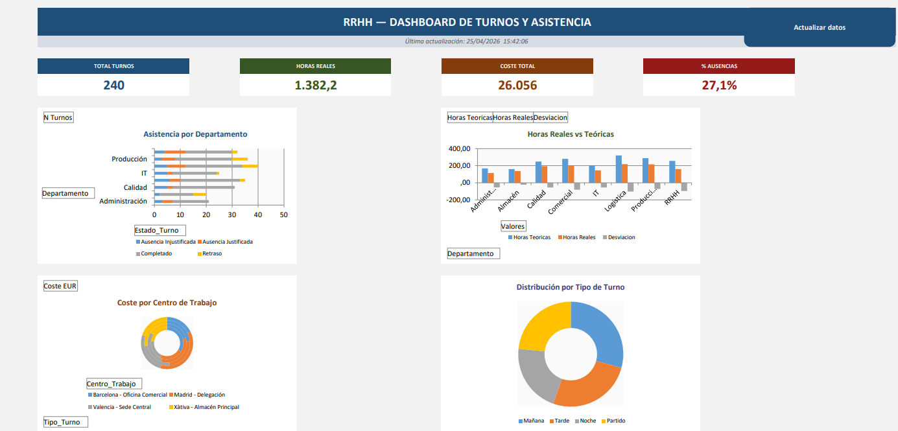

# 📊 RRHH — Automatización Excel con Power Query y VBA

Portfolio project que demuestra un flujo completo de trabajo con datos de RRHH en Excel: desde datos brutos y sucios hasta un dashboard interactivo totalmente automatizado.



---

## 🗂️ Estructura del proyecto

```
📁 automatizacion-RRHH-Excel/
├── RRHH_Base_Dataset.xlsx      # Dataset bruto con inconsistencias intencionadas
├── Automatizacion.xlsx         # Libro final: Power Query + Tablas dinámicas + Dashboard + Macro VBA
└── README.md
```

---

## 🎯 Objetivo

Simular el escenario real de una empresa que exporta datos de RRHH desde múltiples sistemas (SAP HR, A3NOM, Wolters Kluwer, Excel local...) con formatos inconsistentes, y construir un proceso automatizado de limpieza, análisis y visualización.

---

## 📁 Archivos

### `RRHH_Base_Dataset.xlsx`

Simula la exportación directa de un sistema HR. Contiene **dos hojas con datos sucios intencionados**:

**Hoja `Empleados`** — Maestro de ~200 empleados con los siguientes problemas:
- Campo `País` con múltiples formatos: `spain`, `España`, `ES`, `ESP`, `ESPAA`
- Campo `Sexo` inconsistente: `H`, `M`, `F`, `Masculino`, `MASCULINO`, `Hombre`, `Mujer`, `Femenino`
- Emails truncados (sin `@`)
- Fechas de alta sin separadores: `02122019` en lugar de `02/12/2019`
- Valores nulos codificados como `ND` en lugar de celdas vacías
- Columnas irrelevantes marcadas en amarillo (ruido a eliminar)

**Hoja `Turnos`** — Registro de ~240 turnos con los siguientes problemas:
- Campo `HoraInicio` con 8 formatos distintos: `0800`, `08.00`, `8h`, `6h`, `06.00`, `060000`, `140000`, `22h`
- Campo `Fecha` en dos formatos: `04102024` y `2024-07-17`
- Campo `ValidadoRRHH` con valores imposibles de agrupar: `True`, `False`, `S`, `SI`, `1`, `0`, `No`, `Pendiente`
- Columnas redundantes (NombreEmpleado y Departamento duplicados desde la tabla de empleados)

---

### `Automatizacion.xlsx`

Libro principal con el proceso completo automatizado. Contiene **3 hojas**:

| Hoja | Descripción |
|---|---|
| `Turnos y empleados` | Tabla limpia y enriquecida generada por Power Query |
| `Análisis` | 5 tablas dinámicas generadas automáticamente por la macro |
| `Dashboard` | 4 KPIs + 4 gráficos + botón de refresco, generados automáticamente |

---

## 🔧 Paso 1 — Limpieza con Power Query

La consulta Power Query (`Turnos_y_empleados`) realiza los siguientes pasos sobre los datos brutos:

- **Eliminación de columnas ruido**: se descartan columnas redundantes o irrelevantes (`TallaRopa`, `EstadoCivil`, `SistemaOrigen`, `NombreEmpleado`, `DepartamentoTurno`...)
- **Normalización de fechas**: `02122019` → `date(2019,12,02)` usando texto con formato fijo; `2024-07-17` parseado directamente
- **Normalización de hora de inicio**: expresiones `0800`, `08.00`, `8h`, `060000`... unificadas a valor decimal `8.0`, `14.0`, `22.0`
- **Normalización de género**: todos los valores (`H`, `M`, `Masculino`, `MASCULINO`, `Hombre`...) mapeados a `Hombre` / `Mujer` / `No especificado`
- **Normalización de país**: `spain`, `España`, `ES`, `ESP`, `ESPAA` → `España`
- **Normalización de ValidadoRRHH**: `True`, `SI`, `S`, `1` → `Sí`; `False`, `No`, `0` → `No`; resto → `Pendiente`
- **Columnas calculadas nuevas**:
  - `Nombre_Completo` = Nombre + Apellido1 + Apellido2
  - `Desviacion_Horas` = Horas_Reales − Horas_Teoricas
  - `AntiguedadAnos` calculada desde `FechaAlta` hasta hoy
  - `MesAno` para agrupación temporal

---

## ⚙️ Paso 2 — Macro VBA: `ActualizarTodo()`

La macro automatiza todo el proceso post-limpieza con un solo clic. Se estructura en módulos independientes:

```
ActualizarTodo()
  ├── ValidarEntorno()          → comprueba hojas, tabla y columnas antes de ejecutar
  ├── RefrescarPowerQuery()     → refresco síncrono de todas las conexiones
  ├── CrearHojas()              → crea/recrea las hojas Análisis y Dashboard
  ├── ConstruirTablasDinamicas() → genera 5 tablas dinámicas en Análisis
  ├── ConstruirDashboard()      → genera KPIs, gráficos y layout en Dashboard
  └── CrearBotonRefresco()      → inserta el botón "Actualizar datos"
```

### Tablas dinámicas generadas

| Nombre | Contenido |
|---|---|
| `TD_Asistencia` | Turnos por departamento × estado (Completado, Ausencia, Retraso) |
| `TD_Horas` | Horas teóricas vs. reales vs. desviación por departamento |
| `TD_Costes` | Coste total por centro de trabajo × tipo de turno |
| `TD_Absentismo` | Distribución de ausencias por tipo de contrato |
| `TD_Ranking` | Ranking de empleados por horas trabajadas (orden descendente) |

### KPIs del Dashboard

| KPI | Fórmula |
|---|---|
| Total Turnos | `COUNTA(ID_Turno)` |
| Horas Reales | `SUM(Horas_Reales)` |
| Coste Total | `SUM(Coste_Real_EUR)` |
| % Ausencias | `COUNTIF(Estado_Turno,"Ausencia*") / COUNTA(ID_Turno)` |

### Buenas prácticas aplicadas en el código VBA

- `Option Explicit` — todas las variables declaradas explícitamente
- `On Error GoTo GestorError` — gestión centralizada de errores
- `DesactivarApp` / `RestaurarApp` — control de estado de `Application` en un único punto, con `On Error Resume Next` en la restauración para garantizar que Excel nunca queda en estado roto
- `Application.EnableEvents = False` durante la ejecución
- Validación previa completa antes de ejecutar cualquier acción
- Conteo de datos con bucle VBA directo (sin fórmulas) para independencia de `xlCalculationManual`
- `.PlotVisibleOnly = False` en gráfico con datos en columnas ocultas

---

## ▶️ Cómo usar

1. Abre `Automatizacion.xlsx`
2. Si Excel pide habilitar macros, acepta
3. Ve a la hoja `Dashboard` y pulsa el botón **"Actualizar datos"**
4. La macro valida el entorno, refresca Power Query, regenera las tablas dinámicas y reconstruye el dashboard completo
5. Un mensaje confirma el tiempo de ejecución al finalizar

> **Nota**: el libro debe guardarse en formato `.xlsm` para preservar las macros.

---

## 🛠️ Requisitos

- Microsoft Excel 2016 o superior (Windows)
- Macros habilitadas
- No requiere complementos ni referencias externas adicionales

---

## 📌 Tecnologías

`Excel` · `Power Query (M)` · `VBA` · `Tablas dinámicas` · `Gráficos dinámicos`

---

## 👤 Autor

**Juan Martínez**  
[LinkedIn]([https://www.linkedin.com/in/tu-perfil](https://www.linkedin.com/in/juanmartinezm/)
